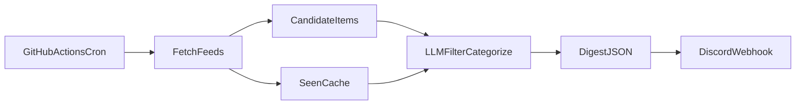

# Daily Tech Digest (cache-me-up)

## Decisions locked

- **Gathering:** Hybrid — RSS/APIs for candidates, LLM for filter / categorize / summarize
- **Runtime:** GitHub Actions scheduled workflow
- **Delivery:** Single Discord channel via webhook (embeds or markdown)
- **Defaults:** TypeScript (Node 20), OpenAI-compatible chat API (`OPENAI_API_KEY` + configurable model), schedule **11:00 UTC** (5:00 AM CST)

## Architecture




1. Cron triggers daily.
2. Fetchers pull recent items (roughly last 24–48h) from configured sources.
3. Dedupe against a short-lived **seen IDs** cache (Actions cache) so the same link is not re-sent for a few days.
4. LLM receives a capped candidate list and returns structured JSON mapped to your four categories, each with title, 1–2 sentence blurb, and source URL.
5. Formatter posts one Discord webhook message (header + four sections). If empty after filtering, post a short “nothing new” note or skip (default: skip to reduce noise).

## Categories (Discord sections)

- **New AI models**
- **Project inspiration**
- **AI / programming concepts**
- **Cool builds**

Target ~3–5 items per section when available; allow empty sections to be omitted.

## Initial sources (config-driven)

All sources live in something like `[config/sources.json](config/sources.json)` so you can add/remove feeds without code changes.


| Interest    | Sources                                                                                                                                    |
| ----------- | ------------------------------------------------------------------------------------------------------------------------------------------ |
| Models      | Hugging Face Hub recent models API; RSS from major lab blogs (OpenAI, Anthropic, Google DeepMind, Meta AI) as available; HN + r/LocalLLaMA |
| Inspiration | Hacker News (Show HN + top); GitHub Trending (daily); Product Hunt (optional, if API/RSS works)                                            |
| Concepts    | arXiv (cs.AI / cs.LG / cs.SE abstracts); HN; Lobsters `ai` / `programming`                                                                 |
| Cool builds | Show HN; r/MachineLearning; r/programming; GitHub trending                                                                                 |


Each fetched item normalizes to: `{ id, title, url, source, publishedAt, snippet? }`.

## Project layout

```
cache-me-up/
  package.json
  tsconfig.json
  config/sources.json
  src/
    index.ts              # CLI entry: fetch → dedupe → LLM → Discord
    fetchers/*.ts         # per-source adapters
    types.ts
    dedupe.ts             # seen-id store (file path for local + Actions)
    llm.ts                # structured JSON via chat completions
    format.ts             # Discord payload
    discord.ts            # webhook POST
  .github/workflows/daily-digest.yml
  .env.example
  README.md
```

## LLM contract

- Input: JSON array of candidates (title, url, source, snippet), plus category definitions and “prefer novelty / engineer-relevant / must keep original URL” rules.
- Output: strict JSON schema, e.g. `{ categories: { new_models: Item[], ... } }` where `Item = { title, summary, url, source }`.
- Reject any item whose URL was not in the candidate set (anti-hallucination).
- Cap tokens by sending at most ~40–60 candidates (score/sort by recency + simple keyword boosts before LLM).

## Discord delivery

- Env: `DISCORD_WEBHOOK_URL`
- One message (or split if >2000 chars using sequential posts).
- Format: date header + bold section titles + bullet lines `**title** — summary ([source](url))`.

## GitHub Actions

`[/.github/workflows/daily-digest.yml](.github/workflows/daily-digest.yml)`:

- `schedule: cron: '0 11 * * *'` plus `workflow_dispatch` for manual runs
- Node setup → `npm ci` → `npm run digest`
- Secrets: `OPENAI_API_KEY`, `DISCORD_WEBHOOK_URL` (optional `OPENAI_MODEL`, `OPENAI_BASE_URL` for compatible providers)
- Persist `data/seen.json` via `actions/cache` keyed by date window so repeats are suppressed across runs

## Local usage

- Copy `.env.example` → `.env`
- `npm run digest` to test the full pipeline without waiting for cron

## Out of scope for v1

- Discord bot, web UI, personalization ML, email, multi-channel routing
- Full web browsing / open-ended agent search (can add later as an optional fetcher)

## Implementation order

1. Scaffold package + types + sources config
2. Implement fetchers + normalize + pre-rank
3. Dedupe + LLM step with URL allowlist validation
4. Discord formatter + webhook client
5. Wire CLI + GitHub Actions + README (setup: Discord webhook, OpenAI key, enable Actions)

