# Daily Tech Digest — System Architecture

This document explains the end-to-end architecture of the **Daily Tech Digest** project (`cache-me-up`). It is written to be approachable for someone with **no prior knowledge of cron jobs or Discord webhooks** — those concepts are explained from first principles as they come up.

---

## 1. What this system does

The Daily Tech Digest is an automated pipeline that:

1. **Gathers** recent tech/AI content from a set of configured sources (RSS feeds, APIs, and public listing sites).
2. **Filters and categorizes** that content using a Large Language Model (LLM) into four reader-friendly "buckets."
3. **Formats** the result into a single, clean message.
4. **Posts** that message into a Discord channel automatically, on a daily schedule.

The point is to remove the daily chore of checking many different sites and feeds. Instead, a curated digest shows up in one place — a Discord channel — every day at a predictable time.

### The four categories

Every item in the digest falls into one of four sections:

| Section | Purpose |
| --- | --- |
| **New AI models** | Recently released or notable AI models |
| **Project inspiration** | Ideas worth building / things that spark a side project |
| **AI / programming concepts** | Educational material: papers, explainers, techniques |
| **Cool builds** | Impressive projects and tools people have shipped |

Each section targets roughly 3–5 items when enough are available, and empty sections are simply omitted from the final message rather than shown as blank headers.

---

## 2. Core concepts, explained from scratch

Before diving into the architecture, here are the two external concepts the system depends on, explained assuming no prior knowledge.

### 2.1 What is a "cron" / scheduled job?

A **cron job** is just *a task that runs automatically on a repeating schedule*.

- "Cron" originally refers to the Unix/Linux utility `cron`, whose configuration uses a special syntax of five time fields. For example, `0 11 * * *` means "at minute 0, hour 11, every day, every month, every day of the week" — i.e. **11:00 every day**.
- You don't need a server running `cron` yourself here. Instead, **GitHub Actions** provides the scheduler. A workflow file in the repo declares the same `cron:` expression, and GitHub's infrastructure wakes up and runs the pipeline at that time.

The key idea to remember: *the system does not need to be "always on."* GitHub Actions spins up a fresh, temporary virtual machine on schedule, runs the code once, and tears it down. This keeps the project free and serverless.

### 2.2 What is a Discord webhook?

A **webhook** is a special URL that lets an *external program* post a message into a Discord channel **without needing a bot or a logged-in user**.

- Normally, posting to Discord requires either a human using the app or a registered bot application.
- A **webhook URL** is a one-time-generated URL that grants limited, one-way "post a message here" access. It looks like `https://discord.com/api/webhooks/<id>/<token>`.
- To send a message, the program makes a simple HTTP `POST` request to that URL with a JSON body describing the message. Discord receives it and displays the message in the channel.

The system treats this URL as a secret (see [Security](#9-security)) because anyone who has it can post into the channel.

### 2.3 What is an "OpenAI-compatible chat API"?

The LLM step needs a model that can read a list of candidate items and return a structured result. Rather than hard-coding a specific vendor, the system targets the **OpenAI chat-completions API shape**, which many providers (OpenAI itself, as well as compatible alternatives) implement.

- You provide an API key (`OPENAI_API_KEY`).
- You can optionally override the model name (`OPENAI_MODEL`) and the API base URL (`OPENAI_BASE_URL`) to point at a compatible provider.

This keeps the pipeline vendor-flexible while using one well-understood request/response format.

---

## 3. High-level architecture

The system is a **linear, one-directional pipeline** of small, independent stages. Data flows from left to right:

```mermaid
flowchart LR
  cron[GitHub Actions cron] --> fetch[Fetch feeds]
  fetch --> candidates[Candidate items]
  candidates --> dedupe[Dedupe vs. seen cache]
  dedupe --> rank[Pre-rank candidates]
  rank --> llm[LLM filter + categorize]
  llm --> validate[URL allowlist validation]
  validate --> digest[Digest JSON]
  digest --> format[Format message]
  format --> discord[Discord webhook POST]
```



Each stage has a single responsibility, which makes the system easy to test and extend:

| Stage | Responsibility |
| --- | --- |
| **Fetch** | Pull recent items from every configured source and normalize them into a common shape |
| **Dedupe** | Drop items that were already sent recently (using a persisted "seen" cache) |
| **Pre-rank** | Sort/score the remaining items and cap the list to a manageable size for the LLM |
| **LLM** | Decide which items are worth including, assign each to a category, and write a 1–2 sentence summary |
| **Validate** | Ensure the LLM didn't invent URLs that weren't in the candidate set (anti-hallucination) |
| **Format** | Turn the structured digest into Discord-friendly markdown |
| **Post** | Send the message(s) to Discord via webhook |

---

## 4. The pipeline, step by step

### Step 1 — Cron triggers the run

At **11:00 UTC** (5:00 AM CST) each day, GitHub Actions starts the workflow. The run can also be triggered manually via the "Run workflow" button (`workflow_dispatch`).

See [GitHub Actions and scheduling](#7-github-actions-and-scheduling) for the full explanation of how this works.

### Step 2 — Fetchers pull recent items

The system reads its source list from `config/sources.json`, so adding or removing a feed is a **configuration change, not a code change**.

For each configured source, a **fetcher adapter** (in `src/fetchers/*.ts`) knows how to:

- Call the source's API or fetch its RSS/Atom feed.
- Extract items published roughly within the **last 24–48 hours**.
- Convert each source's unique format into the project's common shape.

**Common shape (candidate item):**

```ts
{
  id: string;            // stable unique identifier for the item
  title: string;
  url: string;           // canonical link back to the original content
  source: string;        // which feed/API this came from
  publishedAt: string;   // ISO timestamp
  snippet?: string;      // optional short excerpt/abstract
}
```

Why normalize everything to one shape? Because the next stages (dedupe, ranking, LLM) only need to understand *one* data format, no matter how many different sources exist.

### Step 3 — Dedupe against the "seen" cache

The same story often appears across multiple feeds, and a story that was already sent yesterday shouldn't be re-sent today. To handle this, the pipeline keeps a **seen IDs cache** — a small file (`data/seen.json`) listing item IDs/URLs that were already delivered.

- On each run, fetched items whose IDs are in the cache are removed (URLs are
  canonicalized first — tracking params, `www.`, fragments and trailing slashes are
  stripped — so the same story from three feeds collapses to one).
- After a run, newly delivered IDs are added to the cache. IDs that were merely
  *shown to the LLM* are added too, with a shorter window, so a rejected item is not
  paid for again tomorrow but can still resurface later.

The cache therefore has two tiers: **delivered** items (default 5 days) and
**considered** items (default 2 days). Both are rolling windows rather than
permanent, so an item that reappears later can still surface again after a while.
In GitHub Actions, this file is persisted between runs using the **`actions/cache`**
feature (see [State and caching](#73-state-and-caching)).

### Step 4 — Pre-rank and cap

The LLM has a limited "attention budget" and each candidate costs tokens. Sending hundreds of items would be expensive and reduce quality. So before the LLM ever sees anything, the pipeline:

1. Scores/sorts candidates by **recency** plus **simple keyword boosts** (e.g. terms suggesting novelty or engineer-relevance).
2. Caps the list to roughly **40–60** highest-scoring candidates.

This keeps the LLM call cheap, fast, and focused on the most promising items.

### Step 5 — LLM filters, categorizes, and summarizes

The capped candidate list is sent to the LLM with clear instructions and category definitions. The LLM returns **structured JSON** (not free-form prose), so the rest of the pipeline can process it programmatically.

The contract is described in full in [The LLM contract](#5-the-llm-contract).

### Step 6 — URL allowlist validation (anti-hallucination)

LLMs can sometimes "hallucinate" — confidently produce facts or links that weren't actually provided. A hallucinated URL in a digest is bad because readers would click a broken or misleading link.

To prevent this, the pipeline keeps an **allowlist** of every URL that was actually in the candidate set. Any URL returned by the LLM that is **not** on that allowlist is **rejected**. This guarantees every link in the final digest points back to a real source that was actually fetched.

### Step 7 — Format the digest

The validated digest JSON is converted into a Discord message:

- A **date header** (e.g. "Daily Tech Digest — 2026-09-15").
- **Bold section titles** for each non-empty category.
- **Bullet lines** per item, formatted like:

  ```
  **Title** — one-to-two sentence summary ([source](url))
  ```

If the entire digest is empty after filtering, the default behavior is to **skip posting** (to reduce noise). Optionally it can post a short "nothing new today" note.

### Step 8 — Post to Discord

The formatted message is sent by making an HTTP `POST` request to `DISCORD_WEBHOOK_URL`. Discord has a **2000-character limit per message**, so if the digest is longer, the formatter splits it into multiple messages and posts them sequentially (one message per chunk of items, keeping the date header on the first message and repeating the section title on continuations). Posts are spaced ~1 second apart to stay friendly to the webhook rate limit, `429`/`5xx` responses are retried with backoff, and every payload disables mentions (`allowed_mentions.parse: []`) so no one can be pinged by accident. The webhook URL is treated as a secret everywhere: log lines only ever show the webhook id, never the token.

---

## 5. The LLM contract

The LLM step is the "brain" of the system, and its behavior is defined by a strict contract.

### Input

A JSON payload containing:

- The array of candidate items (`title`, `url`, `source`, `snippet`).
- The definitions of the four categories.
- Behavioral rules, including:
  - Prefer **novel** and **engineer-relevant** items.
  - **Always preserve the original URL** (never rewrite or shorten it).

### Output

Strict JSON matching a schema like:

```json
{
  "categories": {
    "new_models": [
      { "title": "...", "summary": "...", "url": "...", "source": "..." }
    ],
    "project_inspiration": [ ],
    "concepts":          [ ],
    "cool_builds":       [ ]
  }
}
```

Where `Item` is:

```ts
{
  title: string;
  summary: string;   // 1–2 sentences
  url: string;       // must be present in the candidate allowlist
  source: string;
}
```

### Enforcement

- **Structured output:** The response is parsed as JSON against the schema
  (`zod`). The request asks for the provider's structured-output mode
  (`response_format: {"type":"json_object"}`); if a provider rejects that — or the
  reply is not parseable — the pipeline retries **once** without structured-output
  mode, adding a short "reply with JSON only" repair instruction. Raw newlines and
  tabs inside JSON strings are repaired automatically. If the second attempt also
  fails, the run fails loudly (visible in Actions) rather than silently posting
  nothing.
- **URL allowlist:** Any returned `url` not in the original candidate set is dropped
  (see [Step 6](#step-6--url-allowlist-validation-anti-hallucination)), and each
  surviving URL is emitted in its canonical form — the exact link that was fetched.
- **Category hygiene:** Missing sections are filled with empty arrays, items are
  trimmed/collapsed, and a story that appears in two categories is kept only once.
- **Token capping:** Input is limited to ~40–60 candidates (see [Step 4](#step-4--pre-rank-and-cap)).

---

## 6. Project layout and components

```
cache-me-up/
  package.json            # deps + scripts ("digest", "digest:dry", "test", "typecheck", "build")
  tsconfig.json           # TypeScript config (Node 20 target)
  config/sources.json     # declarative list of all sources (no code needed to change feeds)
  src/
    index.ts              # CLI entry: fetch → dedupe → rank → LLM → format → post
    fetchers/
      index.ts            # registry + concurrent, failure-isolated runner
      context.ts          # FetchContext/Fetcher contract shared by adapters
      http.ts             # fetch wrapper: timeout, retries, User-Agent
      rss.ts              # RSS 2.0 / Atom / RSS 1.0 parser (lab blogs, Lobsters, Reddit)
      hackernews.ts       # HN via the Algolia search API
      arxiv.ts            # arXiv Atom query builder
      huggingface.ts      # HF Hub models (newest + trending merged)
      github.ts           # trending scrape + repository search API
    types.ts              # shared TypeScript types (CandidateItem, Digest, Item, ...)
    config.ts             # env + sources.json loading and validation (zod)
    dedupe.ts             # seen-ID store (local file + Actions cache)
    rank.ts               # pre-ranking (recency/engagement/keywords) + capping
    llm.ts                # prompt, structured JSON via chat completions, URL allowlist
    format.ts             # turns DigestJSON into Discord markdown, incl. 2000-char splitting
    discord.ts            # HTTP POST to the webhook URL
    util.ts               # URL canonicalization, HTML stripping, truncation helpers
    log.ts                # tiny level-aware logger
  tests/                  # unit tests (node:test, no network required)
  .github/workflows/daily-digest.yml   # GitHub Actions cron + manual trigger
  .github/workflows/ci.yml             # typecheck + tests on push/PR
  .env.example            # template for required environment variables
  README.md               # setup instructions
```

| Component | Role |
| --- | --- |
| `index.ts` | The orchestrator — wires the stages together in order, owns the CLI flags and exit codes |
| `fetchers/*.ts` | Isolate the messy, source-specific logic (parsing RSS, calling APIs); `context.ts` keeps the adapters decoupled from the runner |
| `types.ts` | The single source of truth for data shapes across the project (plus the four category definitions) |
| `config.ts` | Loads `.env` and validates `config/sources.json`; a typo in the config fails fast with a readable error |
| `dedupe.ts` | Reads/writes the seen-ID cache and filters candidates |
| `rank.ts` | Scores candidates (recency + engagement + keyword boosts) and caps/diversifies the list |
| `llm.ts` | Builds the prompt, calls the chat-completions API, parses/validates JSON, enforces the URL allowlist |
| `format.ts` | Pure function: DigestJSON → markdown string(s), incl. 2000-char splitting |
| `discord.ts` | Thin wrapper around the webhook HTTP POST (no mentions, sequential posts) |
| `tests/` | Offline unit tests for dedupe, ranking, formatting, the LLM contract and the fetcher parsers |

---

## 7. GitHub Actions and scheduling

### 7.1 What GitHub Actions provides

GitHub Actions is a service that runs **workflows** (small programs described in YAML files) in response to **events** — like a push, a pull request, or a **schedule**.

For this project, the workflow file `.github/workflows/daily-digest.yml` declares two triggers:

1. **Schedule (`cron`)** — `'0 11 * * *'`, i.e. daily at 11:00 UTC (5:00 AM CST).
2. **Manual (`workflow_dispatch`)** — a button in the GitHub UI to run on demand.

> **Note on schedule accuracy:** GitHub does not guarantee cron workflows fire at the exact minute; they can be delayed (often by a few minutes to over an hour under load). The design therefore treats the time as "roughly daily," which is fine for a digest.

> **Note on time zones:** GitHub schedules run in **UTC**, not local time. 5:00 AM CST (Central *Standard* Time, UTC−6) corresponds to **11:00 UTC**. If you instead want the digest at 5:00 AM *local wall-clock time* year-round, keep in mind that Central observes Daylight Saving Time (CDT, UTC−5) from roughly March to November, so you'd switch the schedule to `0 10 * * *` during the summer months.

### 7.2 What the workflow does

Each run:

1. Spins up a fresh **Ubuntu runner** (temporary virtual machine).
2. Checks out the repository.
3. Sets up **Node 20** (`actions/setup-node` with npm caching).
4. Restores `data/seen.json` from cache (if a previous run saved one).
5. Runs `npm ci` to install exact dependencies.
6. Runs `npm run digest` (which executes `src/index.ts`).
7. Saves the updated `data/seen.json` back to cache (only when the step succeeded).
8. Tears the machine down.

The workflow also accepts a manual **dry run** input plus a `log_level` choice, and a
`concurrency` group ensures a manual run can never overlap the scheduled one.
A separate `ci.yml` workflow runs `npm run typecheck` and `npm test` on pushes and
pull requests, so a broken parser or prompt change is caught before the cron fires.

### 7.3 State and caching

Because each run starts from a **fresh machine**, there is no persistent filesystem between runs. The dedupe cache (`data/seen.json`) would be lost every time — which would mean the same items get re-sent every day.

The solution is **`actions/cache`**, a GitHub Actions feature that can save a set of files at the end of a run and restore them at the start of the next run:

- On run start: **restore** `data/seen.json` from cache (if present).
- On run end: **save** the updated `data/seen.json` back to cache.

The cache key includes the workflow **run id**, so every run writes a fresh entry,
while `restore-keys: seen-` picks up the newest previous entry. GitHub evicts cache
entries that have not been read for ~7 days, which naturally makes the seen list
"short-lived" — old entries fall out of the active window, so very old items are
allowed to resurface later. This matches the design goal of suppressing repeats for
"a few days," not forever.

### 7.4 Running the pipeline outside Actions

The same entry point runs locally, which is how the pipeline is developed and
debugged:

| Command | Behaviour |
| --- | --- |
| `npm run digest` | Full run: fetch → dedupe → rank → LLM → post → save cache |
| `npm run digest:dry` | Everything except the post; nothing is written to the seen cache |
| `npm run digest:dry -- --print-candidates` | Also logs every ranked candidate with its score |
| `npm test` / `npm run typecheck` | Offline unit tests (no network) and type checking |

The CLI accepts `--dry-run` and `--print-candidates`; unknown flags are ignored.
Without `OPENAI_API_KEY` a dry run deliberately stops after pre-ranking, which is
enough to exercise every fetcher, the dedupe cache and the ranking stage.

---

## 8. Configuration and secrets

### 8.1 `config/sources.json`

The full list of feeds/APIs lives in a declarative JSON config. Each entry describes:

- The **source type** (`kind` — which fetcher adapter to use).
- The **URL/endpoint** to fetch (`url`, required for `rss`).
- Optional **tags** (HN story sets, arXiv categories).
- An **interest/category hint** used for ranking (`interest`).
- Optional knobs: `enabled`, `limit`, `minPoints`, `minStars`, `query`.

The config is validated at startup with `zod`; an unknown field, a bad `kind`, or a
duplicate `id` aborts the run with a readable message instead of silently ignoring
the mistake. Top-level settings (`lookbackHours`, `maxCandidates`,
`maxItemsPerSource`) override the matching environment variables when present.

Two deliberate default choices:

- The **Reddit** sources ship with `"enabled": false`. Reddit returns HTTP 429 for
  most shared/datacenter IPs (GitHub runners included), so they are opt-in.
- **Anthropic** publishes no public RSS feed, so the "major lab blogs" are OpenAI,
  Google DeepMind, Google AI, Meta AI and the Hugging Face blog.

This is how the plan maps interests to sources:

| Interest | Sources |
| --- | --- |
| **Models** | Hugging Face Hub "recent models" API; RSS from major lab blogs (OpenAI, Anthropic, Google DeepMind, Meta AI) as available; Hacker News + r/LocalLLaMA |
| **Inspiration** | Hacker News (Show HN + top); GitHub Trending (daily); Product Hunt (optional, if API/RSS works) |
| **Concepts** | arXiv (cs.AI / cs.LG / cs.SE abstracts); Hacker News; Lobsters `ai` / `programming` |
| **Cool builds** | Show HN; r/MachineLearning; r/programming; GitHub Trending |

### 8.2 Environment variables

Secrets and tunable settings are provided via environment variables, loaded from a local `.env` file (copied from `.env.example`) for local runs, and via GitHub **Actions secrets** for scheduled runs.

| Variable | Required | Purpose |
| --- | --- | --- |
| `OPENAI_API_KEY` | Yes | Authenticates the LLM chat-completions call |
| `DISCORD_WEBHOOK_URL` | Yes | The webhook URL the message is POSTed to |
| `OPENAI_MODEL` | No | Override the default model name (`gpt-4o-mini`) |
| `OPENAI_BASE_URL` | No | Point at an OpenAI-compatible provider |
| `LOOKBACK_HOURS` | No | Freshness window (default 36); `sources.json` wins if it sets one |
| `MAX_CANDIDATES` | No | LLM input cap (default 50) |
| `MAX_ITEMS_PER_SOURCE` | No | Per-source diversification cap (default 12) |
| `SEEN_STORE_PATH` | No | Where the seen cache lives (default `data/seen.json`) |
| `SEEN_WINDOW_DAYS` | No | How long delivered items stay suppressed (default 5) |
| `CONSIDERED_WINDOW_DAYS` | No | How long LLM-reviewed-but-not-delivered items stay suppressed (default 2) |
| `DIGEST_POST_EMPTY` | No | `true` posts a "nothing new" note instead of staying silent |
| `FETCH_TIMEOUT_MS` | No | Per-request HTTP timeout for fetchers (default 20000) |
| `LLM_TIMEOUT_MS` | No | Timeout for the chat-completions call (default 120000) |
| `LOG_LEVEL` | No | `debug` \| `info` \| `warn` \| `error` (default `info`) |
| `GITHUB_TOKEN` | No | Raises the GitHub search API rate limit |

Missing required variables produce one aggregated, readable error mentioning which
secret is absent and where to put it.

---

## 9. Security

- **`DISCORD_WEBHOOK_URL` and `OPENAI_API_KEY` are secrets.** Anyone with the webhook URL can post to the channel; anyone with the API key can spend money/invoke the model. They must never be committed to the repo. In GitHub Actions they are stored as **encrypted repository secrets** and injected only at runtime.
- **`.env` is gitignored.** The `.env.example` file contains *placeholders only*, so developers know which variables to set without exposing real values.
- **Anti-hallucination URL allowlist** protects users from clicking links the LLM invented (see [Step 6](#step-6--url-allowlist-validation-anti-hallucination)).
- **Least privilege:** the webhook grants only "post a message" capability — it cannot read the channel, manage the server, or act as a bot with broader permissions.

---

## 10. Failure modes and resilience

| Failure | Consequence | Mitigation |
| --- | --- | --- |
| A single source is down/rate-limited | That source contributes no items | Fetchers are isolated; one failure is caught and logged without killing the whole run |
| A source's markup or API changes (e.g. GitHub trending) | That adapter returns no items | Parsers are defensive: a zero-result parse logs an explicit warning instead of throwing, and `github-search` covers the same interest |
| LLM returns malformed JSON | Pipeline can't build the digest | Response is validated against the schema, retried once (also covering providers that reject `response_format`), and then surfaced so the run fails loudly (visible in Actions) rather than silently posting nothing |
| LLM returns an unknown URL | A broken/fabricated link | URL allowlist validation drops it |
| Message > 2000 chars | Discord rejects the POST | Formatter splits into sequential messages |
| Webhook returns 429/5xx | Message not sent | Retried with backoff (`Retry-After` honoured), and webhook URLs are validated before the LLM call is paid for |
| Digest is empty after filtering | Nothing to say | Default: skip posting (noise reduction); optional "nothing new" note |
| Cache misses / cold start | No dedupe history, so first run may duplicate | Acceptable; subsequent runs rebuild the cache |

---

## 11. Out of scope for v1

- A full Discord **bot** (the webhook is one-way; no slash commands or reactions).
- Web UI, email delivery, multi-channel routing, or per-user personalization ML.
- Full web browsing / open-ended agentic search (can later be added as an *optional fetcher* without touching the core pipeline).

These boundaries keep v1 small, cheap, and reliable — a single scheduled script, not a long-running service.

---

## 12. Putting it all together

A single day's run looks like this:

```
11:00 UTC ──► GitHub Actions spins up a runner
                ├─ checkout repo, setup Node 20, npm ci
                ├─ restore data/seen.json from cache
                ├─ npm run digest
                │     ├─ read config/sources.json
                │     ├─ each fetcher pulls last 24–48h of items
                │     ├─ normalize to { id, title, url, source, publishedAt, snippet? }
                │     ├─ drop items in seen-cache
                │     ├─ score by recency + keyword boosts, cap to ~40–60
                │     ├─ LLM returns categorized + summarized JSON
                │     ├─ reject any URL not in the allowlist
                │     ├─ format to markdown (split if >2000 chars)
                │     └─ POST to Discord webhook
                ├─ save updated data/seen.json to cache
                └─ runner is torn down
```

The architecture's key strengths are its **linear simplicity** (easy to reason about), **stage isolation** (each part is independently testable and replaceable), and **configuration-driven sources** (adding feeds doesn't require code changes). The two "dumb pipes" — GitHub Actions cron and the Discord webhook — handle scheduling and delivery for free, so the project itself only has to solve the interesting middle: *gathering, filtering, and summarizing*.


